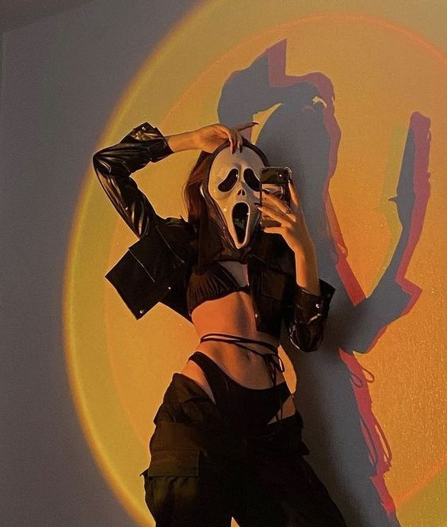

<h1 align="center">
  
</h1>

# Tema da Aula

Turma Online 23 - Todas em Tech  | Front-end | Semana 4 | 2022 | Professora Thiele Nunes 
(Material construido a partir do material da prof Jaqueline)

## Apresentação

### Quem é a Cyberlua?

[Luna Trevisan](https://www.instagram.com/cyberlua7/), é uma pernambucana, aluna da reprograma da turma on23 front-end e uma apaixonada pelos jogos eletrônicos e desse universo da tecnologia, e claro, amandando essa área da programação. 

#### Contatos

- [E-mail](cyberlua7@gmail.com)
- [LinkedIn](https://www.linkedin.com/in/cyberlua7/)
- [GitHub](https://github.com/cyberlua)

## Conhecendo o projeto

## 🧠 Contexto

O objetivo é criar um página em HTML y CSS de uma Maravilhosa Brasileira que eu admiro. Minha maravilhosa escolhida foi a nossa rainha do rock brasileiro Rita Lee. 
Praticando o que foi passado no conteúdo: 
- pastas e arquivos organizados
- tags básicas
- tags estruturais
- tags semânticas

## Tags semânticas utilizadas:

* nav 
* a
* header
* main
* section
* article
* header
* aside
* footer

## Conheça a Reprograma

Vou deixar os links para vocês conhecer a Reprograma, essa rede de mulheres para mulheres na tecnologia. 

- [Web](https://reprograma.com.br/)
- [LinkedIn](https://www.linkedin.com/company/reprogramabr/)

## Agradecimento 💜

Quero agradecer a professora Thi que teve muita paciência e uma didática maravilhosa. 
A Mari nossa monitora/facilitadora que é outra pessoa incrível, ambas muito atenciosas.
E por fim agradecer a minhas colegas de turmas que faz com que esse ambiente seja confortável e acolhedor.